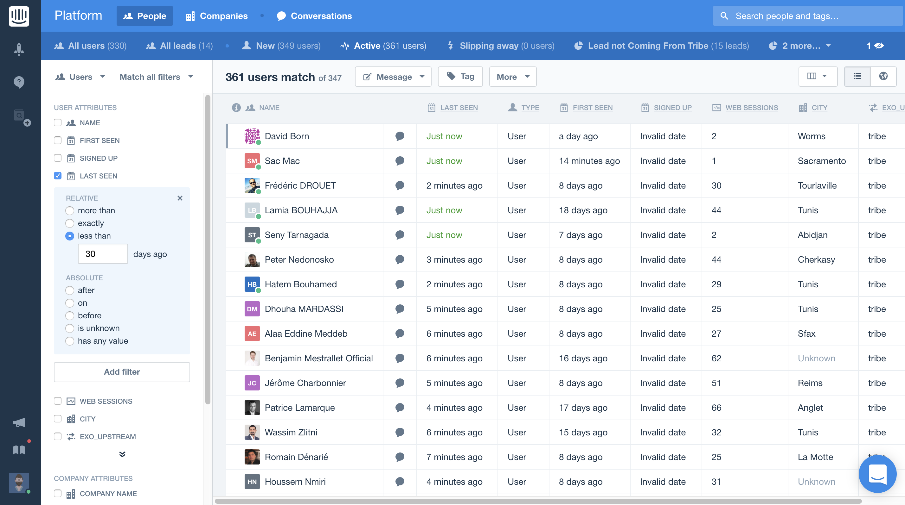

= Intercom Addon
:toc:
:toclevels: 4

Bringing up ChatBot capabilities to your website

== Overview

Intercom is an automated virtual assistance chat tool—commonly referred to as a "chatbot".

You can see it as a circle-shaped chat button located on the bottom-right side of your screen.

== What does it do?

We hope that this tool will improve the journey of people visiting our website and/or community by allowing them to write questions and receive guidance in real time.

* *It is contextual*: For example, suppose that you are browsing the eXo Platform editions/pricing page on our website and would like to learn more about that: you can use this chatbot to request more information that you seek about that topic.
* It can automatically put you in touch with the right team in the back-end: If you need to contact us, this tool helps save time by collecting basic information and then redirecting straight to the right eXo person to talk to.
* It works across both sites and will recognize you as the same visitor: It won’t lose track of who you are if you navigate between our website and our online community site.

== How does it work?

Under the hood, it’s leveraging some neat/mature 3rd party chatbot technology. It’s highly configurable by our developers, allowing us to specify the workflows that power it according to different possible scenarios and navigation contexts.
This is our first experimental implementation of it and we will keep improving it.

== Getting Started

Intercom add-on can be installed from Add-ons catalog or build from sources.

=== Requirement

Actually we need to have the following tools :

* *PLF 5.0.0-Mxx*
* *JDK 1.8*
* *maven 3.5*

=== Build from sources

To build add-on from sources use Maven 3.

Clone the project with :

[source, shell]
----
git clone git@github.com:exo-addons/intercom.git
cd intercom
----

Build it with :

[source, shell]
----
mvn clean package
----

Go to packaging bundle file created by last build in intercom/intercom-packaging/target/intercom-integration.zip. Use it for deployment to Platform below.

=== Deploy to eXo Platform

Install eXo Platform Tomcat bundle to some directory, e.g. /tmp/platform-tomcat.

We can simple install the add-on from central catalog by command:

[source, shell]
----
./addon install intercom:1.0.0-RC02
----

=== Configure Intercom Parameters

Intercom add-on need to know the *APP_ID* as well as the *Identity verification* to Ensure that you’re always talking with actual users.
Add following lines to your exo.properties.

[source, shell]
----
##### Intercom Integration ######
# Hold app_id'value to enable connection with Intercom respond module
intercom.settings.appid=xyz
# Hold secret_key's value to enable Intercom identity verification
intercom.settings.secretkey=xyzef
----

== eXo Platform Compatibility

[caption=""]
|===
|Intercom Version |eXo Platform Version

|1.0.x
|5.0.x
|===

== Troubleshooting

== License